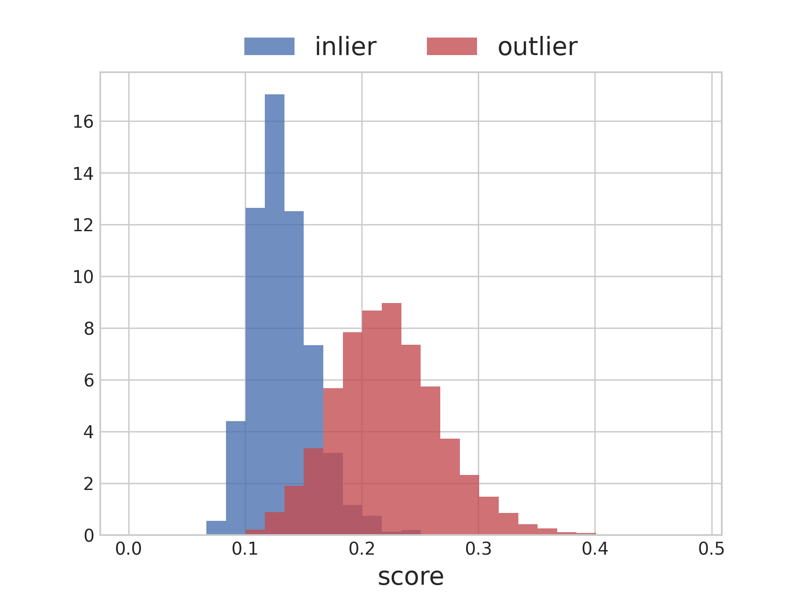
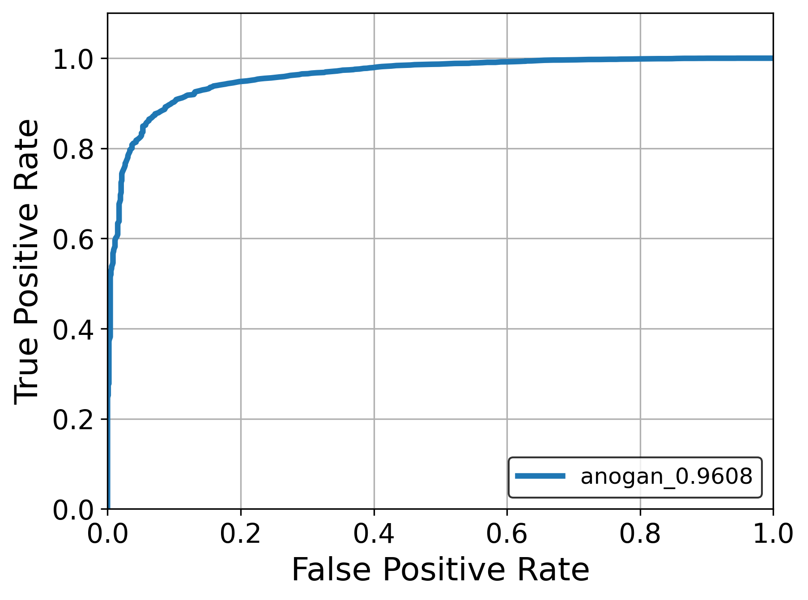
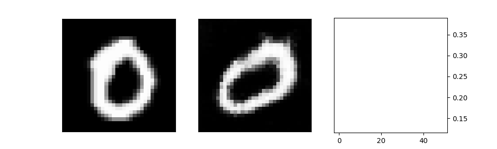
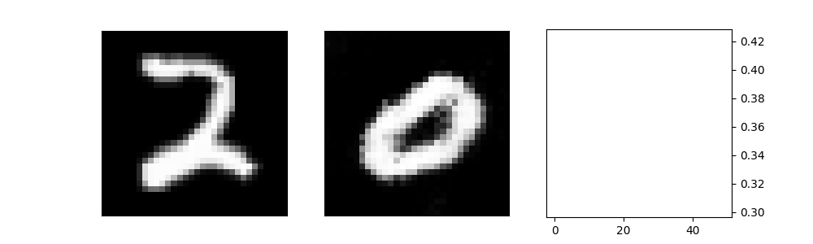

# ANOGAN
Unsupervised Anomaly Detection with Generative Adversarial Networks to Guide Marker Discovery [[paper]](https://arxiv.org/abs/1703.05921)  
GAN's metric is JSD.  

## Environments
* python 3.6
* tensorflow 2.1.0

## Experiments
* Inlier: '0' in MNIST
* Outlier: 'Not 0'

### Discrimination results
|  |  |
|-|-|

### Generated samples
|  |  |
|-|-|
