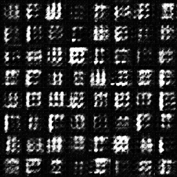
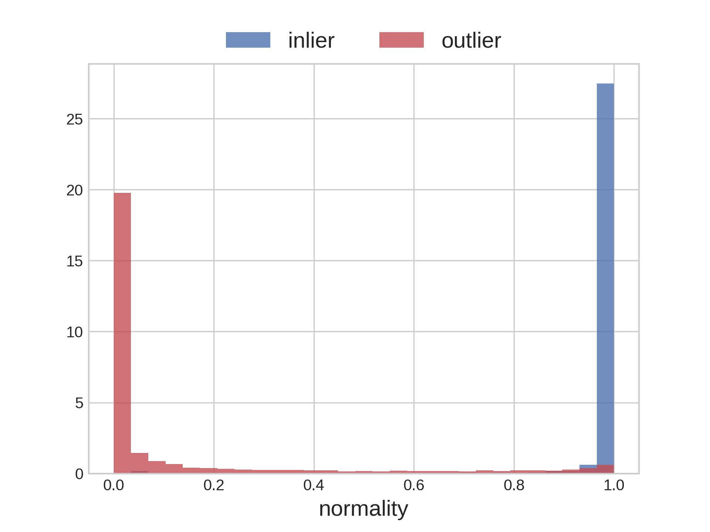
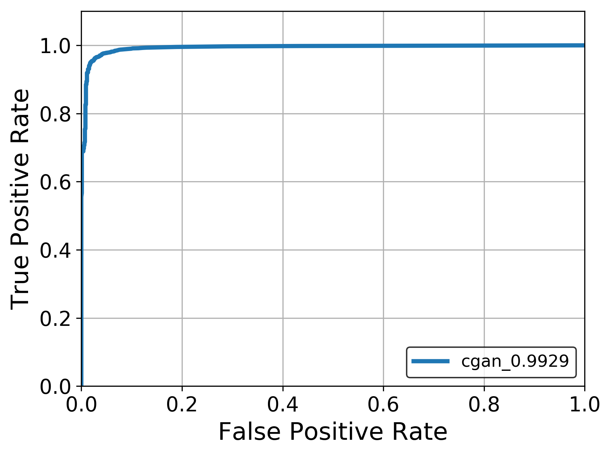

# Complementary GAN
One-Class Adversarial Nets for Fraud Detection [[paper]](https://arxiv.org/abs/1803.01798)  
I implemented only complementary GAN.  
But it has convolutional layers.  

## Environments
* python 3.6
* tensorflow 1.11

## Experiments
* Inlier: '0' in MNIST
* Outlier: 'Not 0'

### Generated samples

### Discrimination results
|  |  |
|-|-|
