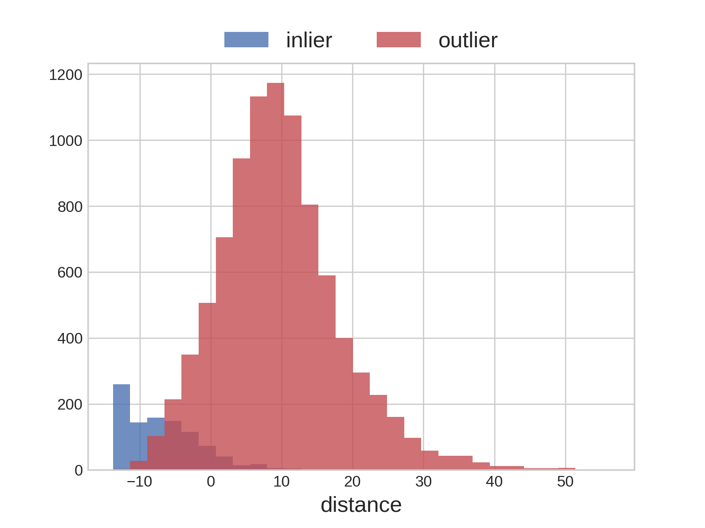
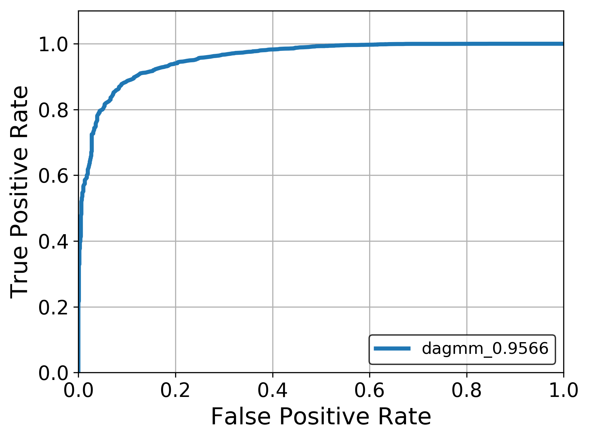

# DAGMM
Deep Autoencoding Gaussian Mixture Model for Unsupervised Anomaly Detection [[paper]](https://openreview.net/forum?id=BJJLHbb0-)  
In this paper, full-connected autoencoder is used.
But in this repository, autoencoder with convolutional layers and full-connected is used.

## Environments
* python 3.6
* tensorflow 2.1.0

## Experiments
* Inlier: '0' in MNIST
* Outlier: 'Not 0'

### Discrimination results
|  |  |
|-|-|
