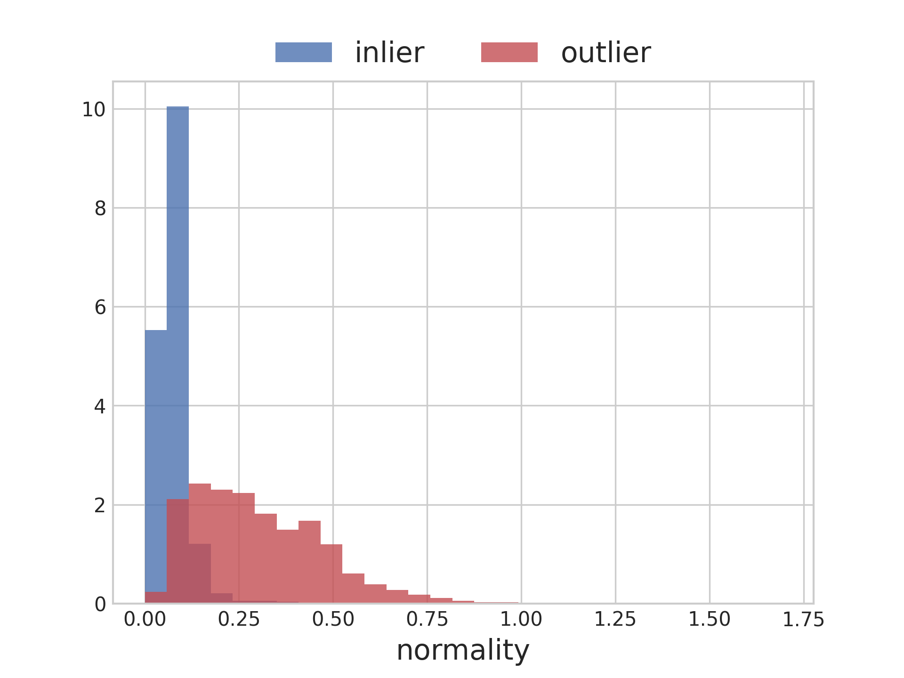
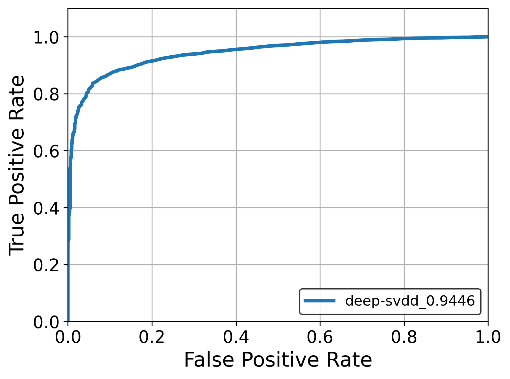

# Complementary GAN
Deep One-Class Classification [[paper]](http://data.bit.uni-bonn.de/publications/ICML2018.pdf)  

## Environments
* python 3.6
* tensorflow 2.1.0

## Experiments
* Inlier: '0' in MNIST
* Outlier: 'Not 0'

### Discrimination results
|  |  |
|-|-|